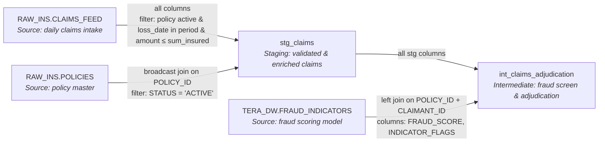

# Claims Processing — Data Lineage

> **Draft — pending data steward review**

End-to-end data lineage for the `claims_processing.sas` migration,
showing source tables, dbt models, join keys, and filters.

## Lineage Diagram

## Edge Details

| From | To | Join Key | Filter / Transform |
|---|---|---|---|
| `RAW_INS.CLAIMS_FEED` | `stg_claims` | *(direct ingest)* | Exclude claims where: policy not found/inactive, `loss_date` outside policy period, `claimed_amount` > `sum_insured`. |
| `RAW_INS.POLICIES` | `stg_claims` | `POLICY_ID` (broadcast join) | `STATUS = 'ACTIVE'` — only active policies are joined. Enriches with `POLICY_TYPE`, `EFFECTIVE_DATE`, `EXPIRATION_DATE`, `SUM_INSURED`, `DEDUCTIBLE`. |
| `stg_claims` | `int_claims_adjudication` | *(ref — all rows)* | All validated claims flow through. Adds derived columns: `fraud_risk`, `adjudication_result`, `adjudication_reason`, `approved_amount`, `processing_date`. |
| `TERA_DW.FRAUD_INDICATORS` | `int_claims_adjudication` | `POLICY_ID` + `CLAIMANT_ID` (left join) | No filter — all fraud indicators are joined. NULLs (no match) default to `fraud_risk = 'LOW'`. |
